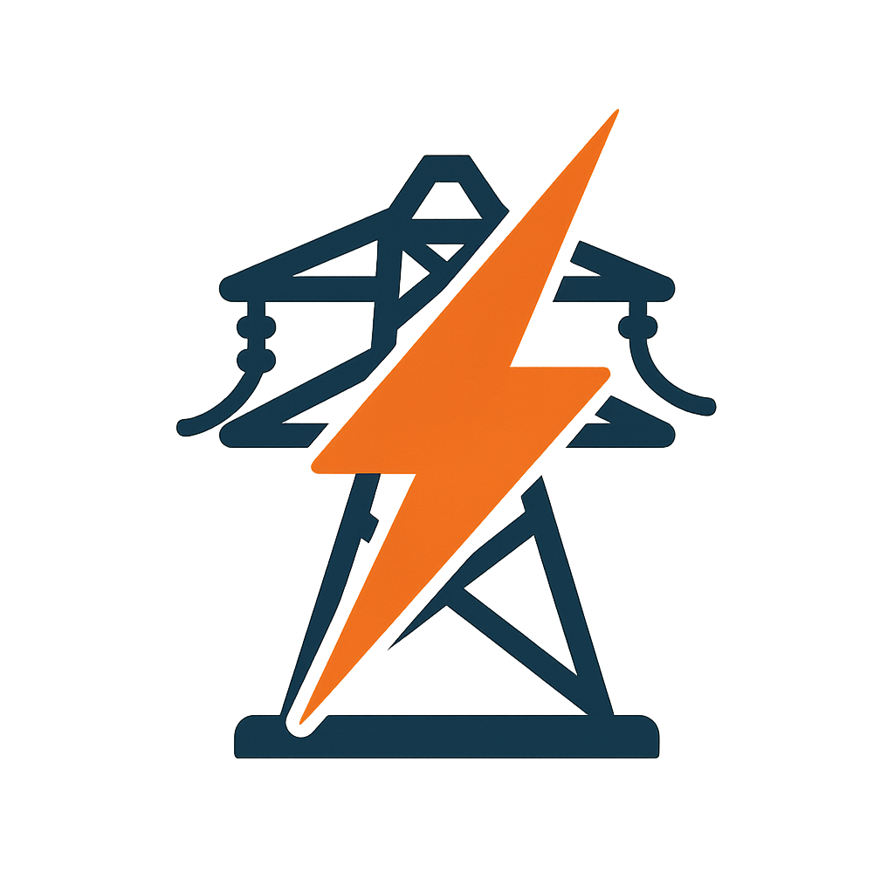

# Elektrárna plugin pro Homebridge

_ENG: This plugin imports electricity spot prices for the Czech Republic. I don’t expect users from other countries, so the plugin is available only in Czech._

**Plugin _Elektrárna_ slouží k importu aktuální spotové ceny elektřiny do [Apple Home](https://www.apple.com/home-app/) pomocí [Homebridge](https://homebridge.io).**

Díky znalosti aktuální ceny můžete automatizovat akce a využít ji ve svých scénářích, ať už zapnout spotřebu nebo naopak vypnout zbytné a náročné spotřebiče.
Řada uživatelů automatizuje svou domácnost pomocí [Home Assistant](https://www.home-assistant.io), ale v některých scénářích a pro některé _Apple Home_ příslušenství může být vhodné či nutné použít _Homebridge_.
Tento plugin Vám dává další možnost jak automatizovat.

Ceny se získávají z veřejného API projektu [Elektrárna](https://elektrarna.hostmania.eu), ve výchozím nastavení každou minutu. Ceny jsou v Kč/kWh bez DPH.
**_Apple Home_ má značná omezení oproti _Home Assistant_ a z toho vyplývají tyto tři nepříjemnosti:**
1. plugin _Elektrárna_ se do _Apple Home_ integruje jako teplotní čidlo (z dostupných možností pouze teplota umožňuje záporná čísla a zároveň má desetinná místa)
2. nelze odebrat symbol stupňů Celsia (_Apple HomeKit_ vůbec nepodporuje bezrozměrná čísla a doplňuje sám jednotky)
3. plugin dostává i předává hodnotu s dvěma desetinnými místy, ale ve výsledku to _Homebridge_ a následně i _Apple Home_ zaokrouhlují. Výsledky jsou zaokrouhlené po půl stupni, tj. 0,50Kč.
Vzniká tak nepřesnost +- 0,25Kč, se kterou je třeba při automatizaci počítat.

**INSTALACE**

1. Přihlašte se do svého _Homebridge_

2. Otevřete v menu volbu _Terminál_

3. Zadejte do něj příkaz: `hb-service add homebridge-elektrarna`
   

4. Počkejte na konec instalace balíčku

5. Pro dokončení a zapnutí pluginu je třeba jít do _Pluginy_

6. Otevřete _Nastavení_ tohoto nově nainstalovaného pluginu a **uložte ho** (tj. nezavírejte ho bez uložení)
   

7. V dalším kroku ukládání vypněte volbu _dětský bridge_ - pokud byste to nechali zapnuté, zkomplikovali byste si přidání. Uložte to.

8. Homebridge si vyžádá restart

9. Po restartu se v _Příslušenství_ objeví nový "sensor" který bude mít spotovou cenu

10. Nyní by se měla spotová cena objevit v _Apple Home_ jako teplotní senzor a můžete si ho zobrazit nebo na něj navázat automatizaci.
Přibyly také tři kontaktní senzory, které signalizují cenovou úroveň (nízká, střední, vysoká) a lze je také využít jako signál pro další zařízení. Pokud je kontaktní čidlo rozepnuto (otevřeno), platí daná úroveň.
V _Homebridge_ je uvidíte správně pojmenované, _Apple Home_ je může pojmenovat všechny stejně. V takovém případě musíte zjistit, který je který a pojmenovat si je sami.

Všechny cenové úseky (15min) jsou rozděleny rovnoměrně do tří cenových skupin: nízká, střední, vysoká.
Tj. 8 hodin (32 čtvrthodin) je nejlevnějších, podobně to platí i pro střední a vysoké. Nejde ale o souvislý blok 8 hodin! Vizte web [Elektrárna](https://elektrarna.hostmania.eu)

